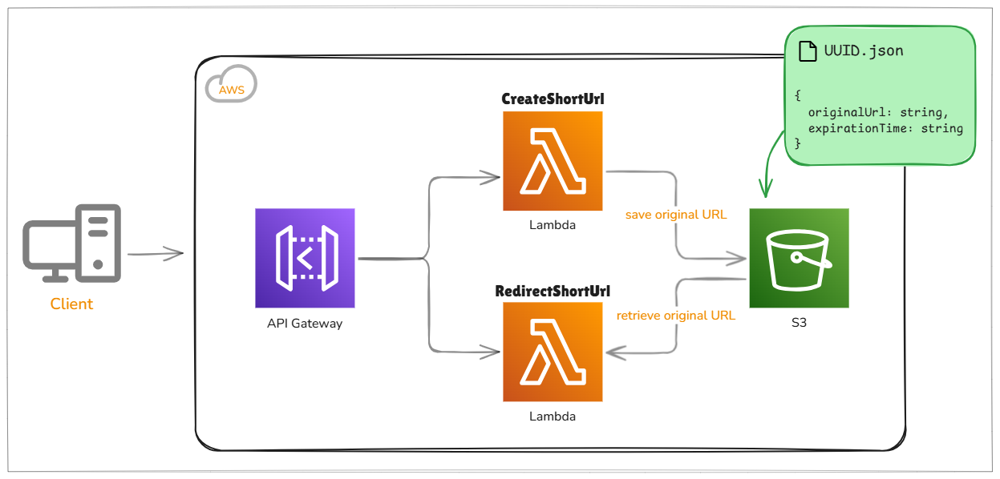

# URL Shortener

A URL shortener using AWS services like Lambda and S3. Project created from a free Java course.

### Architecture


## API

- `/create` - Call <ins>CreateShortUrl</ins> Lambda to save data in a JSON file on S3.

```json
Request body:

{
  "originalUrl": "https://www.something.com",
  "expirationTime": "1732737264" //needs to be in seconds
}
```

- `/{urlCode}` - Call <ins>RedirectShortUrl</ins> Lambda to find a JSON file on S3 that matches the `urlCode` and redirects to original URL.

## Technologies

- Java 17
- Maven
- AWS
  - API Gateway
  - Lambda
  - S3
